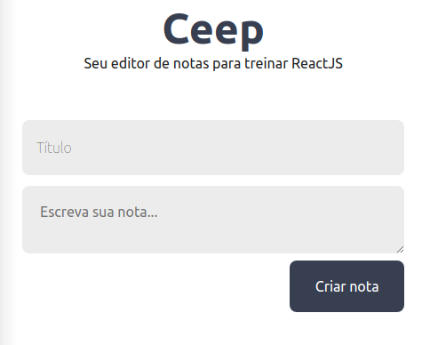

<div  align="center">
  
</div>

<h1 align="center">Your grade editor to train ReactJS</h1>

## :clipboard: Description
<p>Note-making application.</p>
<p>Made to learn and understand the ReactJS library using classes and components.</p>

## :rocket: Tecnologies

This project was developed at the [Alura](https://www.alura.com.br) with the following technologies:

-  [ReactJS](https://reactjs.org/)
-  [VS Code][vc]

## :information_source: How To Use
To clone and run this application, you'll need [Git](https://git-scm.com), [Node.js v12.18.3][nodejs] or heigher + [Yarn v1.22.4][yarn] or higher installed on your computer. From your command line:

```bash
# Clone this repository
$ git clone https://github.com/daniel21h/ceep.git

# Go into the repository
$ cd ceep

# Install dependencies
$ yarn install

# Run the server
$ yarn start
```

---

Made by Daniel Hessel :wave: [Get in touch!](https://www.linkedin.com/in/daniel-hessel-240731176/)


[nodejs]: https://nodejs.org/
[yarn]: https://yarnpkg.com/
[vc]: https://code.visualstudio.com/
